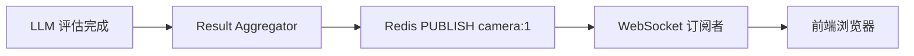

# Redis 在交通监控系统中的作用详解

## 📋 目录
1. [Redis 概述](#redis-概述)
2. [核心作用](#核心作用)
3. [数据结构与用途](#数据结构与用途)
4. [与 Kafka 的配合](#与-kafka-的配合)
5. [可选性说明](#可选性说明)

---

## Redis 概述

在这个交通监控系统中，Redis 主要用于 **Result Aggregator** 组件，负责数据缓存和实时推送。

### 基本配置
```yaml
# deployment/docker-compose.infra.yml
redis:
  image: redis:7-alpine
  ports:
    - "6379:6379"
  command: >
    redis-server
    --appendonly yes          # 持久化
    --maxmemory 2gb           # 最大内存
    --maxmemory-policy allkeys-lru  # LRU 淘汰策略
```

---

## 核心作用

### 🎯 1. WebSocket 消息推送 (Pub/Sub)
**最重要的功能** - 实现实时数据推送到前端

#### 工作流程
```
Result Aggregator → Redis Pub/Sub → WebSocket Handler → 前端
                    (发布)         (订阅)
```

#### 代码实现
```python
# algo/consumers/result_aggregator.py
def _publish_to_websocket(self, camera_id: int, result: Dict[str, Any]):
    """发布结果到 WebSocket 频道"""
    channel = f"camera:{camera_id}"
    result_json = json.dumps(result, ensure_ascii=False)
    self.redis_client.publish(channel, result_json)
    logger.debug(f"Published result to WebSocket channel: {channel}")
```

#### 频道命名规则
- **频道**: `camera:{camera_id}`
- **示例**: `camera:1`, `camera:2`, `camera:101`

#### 数据流向


---

### 📦 2. 最新结果缓存
保存每个摄像头的最新检测结果，便于快速查询

#### 用途
- 新客户端连接时获取最新状态
- 断线重连后恢复数据
- API 查询最新结果

#### 代码实现
```python
def _cache_latest_result(self, camera_id: int, result: Dict[str, Any]):
    """缓存最新结果到 Redis"""
    camera_key = f"camera:{camera_id}:latest"
    result_json = json.dumps(result, ensure_ascii=False)
    # 设置 5 分钟过期时间
    self.redis_client.setex(camera_key, 300, result_json)
```

#### Key 命名规则
- **Key**: `camera:{camera_id}:latest`
- **示例**: `camera:1:latest`, `camera:2:latest`
- **TTL**: 300 秒 (5 分钟)

#### 数据结构
```json
{
  "cameraId": 1,
  "timestamp": "2025-10-20T10:30:00Z",
  "detectedObjects": [...],
  "trafficGroups": [...],
  "riskAssessment": {
    "maxRiskLevel": "high",
    "hasDangerousDriving": true
  },
  "llmLatency": 2.5,
  "llmModel": "qwen-vl-plus"
}
```

---

### 🔔 3. 告警历史存储
存储高风险告警记录，用于历史查询和统计分析

#### 代码实现
```python
def _trigger_alert(self, camera_id: int, result: Dict[str, Any]):
    """触发高风险告警"""
    alert_key = f"alerts:{camera_id}"
    alert_json = json.dumps(result, ensure_ascii=False)
    
    # 添加到告警列表（最多保留 100 条）
    self.redis_client.lpush(alert_key, alert_json)
    self.redis_client.ltrim(alert_key, 0, 99)
    
    logger.warning(f"🚨 High risk alert triggered for camera {camera_id}")
```

#### Key 命名规则
- **Key**: `alerts:{camera_id}`
- **数据结构**: List (列表)
- **最大长度**: 100 条
- **排序**: 最新的在前 (LPUSH)

#### 查询告警历史
```bash
# Redis CLI 命令
redis-cli

# 查看某个摄像头的所有告警
> LRANGE alerts:1 0 -1

# 查看最新 10 条告警
> LRANGE alerts:1 0 9

# 查看告警数量
> LLEN alerts:1
```

---

### 🔄 4. 检测结果临时存储 (可选)
存储原始检测结果，用于与 LLM 评估结果合并

#### 代码实现
```python
def _get_detection_from_redis(self, request_id: str) -> Optional[Dict[str, Any]]:
    """从 Redis 获取检测结果"""
    detection_key = f"detection:{request_id}"
    detection_json = self.redis_client.get(detection_key)
    if detection_json:
        return json.loads(detection_json)
    return None
```

#### Key 命名规则
- **Key**: `detection:{request_id}`
- **示例**: `detection:msg_1729416600123_001`
- **用途**: 关联原始检测数据与 LLM 评估结果

#### 数据流程
```
1. Pipeline 生成检测结果 → 可能存储到 Redis (detection:{id})
2. 发送到 Kafka → Task Generator → LLM Scheduler
3. LLM 返回评估结果 → Result Aggregator
4. Aggregator 从 Redis 取原始数据 (detection:{id})
5. 合并两份数据 → 发布到 WebSocket
```

---

## 数据结构与用途

### Redis 数据类型总览

| Key 模式 | 数据类型 | 用途 | TTL | 示例 |
|---------|---------|------|-----|------|
| `camera:{id}:latest` | String (JSON) | 最新检测结果缓存 | 300s | `camera:1:latest` |
| `camera:{id}` | Pub/Sub Channel | WebSocket 实时推送 | - | `camera:1` |
| `alerts:{id}` | List | 告警历史记录 | 永久 | `alerts:1` |
| `detection:{request_id}` | String (JSON) | 临时检测数据 | 可选 | `detection:msg_123` |

### 内存占用估算

假设：
- 10 个摄像头
- 每个结果约 50KB (包含图片 base64)
- 每个摄像头保留 100 条告警历史

```
最新结果缓存: 10 × 50KB = 500KB
告警历史: 10 × 100 × 50KB = 50MB
总计: ~50MB (不包括临时数据)
```

配置的 2GB 内存绰绰有余。

---

## 与 Kafka 的配合

### Redis vs Kafka 的分工

| 对比项 | Redis | Kafka |
|--------|-------|-------|
| **用途** | 实时推送、缓存查询 | 异步处理、消息队列 |
| **数据流向** | Result Aggregator → 前端 | 各个处理组件之间 |
| **持久化** | 短期缓存 (5分钟) | 长期保留 (24小时) |
| **消费模式** | Pub/Sub (广播) | Consumer Group (负载均衡) |
| **数据特点** | 最新状态 | 完整历史流 |

### 完整数据流

```
┌─────────────────────────────────────────────────────────────┐
│                    检测与评估阶段 (Kafka)                      │
└─────────────────────────────────────────────────────────────┘
  Pipeline → Kafka (detection-results)
           → Task Generator → Kafka (assessment-tasks)
           → LLM Scheduler → Kafka (risk-assessment-results)
           → Result Aggregator
                    ↓
┌─────────────────────────────────────────────────────────────┐
│                  推送与缓存阶段 (Redis)                        │
└─────────────────────────────────────────────────────────────┘
           ┌─→ Redis PUBLISH camera:{id} → WebSocket → 前端
           ├─→ Redis SET camera:{id}:latest (缓存)
           └─→ Redis LPUSH alerts:{id} (告警历史)
```

### 为什么需要两者配合？

#### Kafka 的优势
✅ 可靠的消息传递  
✅ 支持重播和重试  
✅ 解耦各个处理组件  
✅ 横向扩展能力强  

#### Redis 的优势
✅ 超低延迟 (<1ms)  
✅ Pub/Sub 实时推送  
✅ 简单的 Key-Value 查询  
✅ 轻量级缓存  

#### 结合使用
```
Kafka:  处理复杂的异步流程 (检测 → 评估)
Redis:  处理简单的实时推送 (结果 → 前端)
```

---

## 可选性说明

### Redis 是否必需？

**在当前架构中**: **是的，对于实时推送是必需的**

#### 必需的原因
1. **WebSocket 推送依赖 Pub/Sub**
   - Result Aggregator 通过 Redis Pub/Sub 推送结果
   - WebSocket Handler 订阅 Redis 频道
   - 没有 Redis，前端无法实时接收评估结果

2. **缓存最新状态**
   - 新客户端连接时需要获取最新状态
   - 没有 Redis，需要等待下一次检测

### 禁用 Redis 的后果

```python
# 如果禁用 Redis
enable_redis=False
```

**后果**:
- ❌ 前端无法实时接收 LLM 评估结果
- ❌ 无法查询最新检测状态
- ❌ 无法查看告警历史
- ✅ 检测仍然正常进行
- ✅ Kafka 流程仍然正常

### 替代方案

如果不想使用 Redis，可以考虑：

#### 方案 1: 直接 WebSocket 推送
```python
# 在 Result Aggregator 中直接调用 WebSocket
# 需要维护 WebSocket 连接池
# 复杂度高，不推荐
```

#### 方案 2: 使用 Kafka 作为推送源
```python
# WebSocket Handler 直接消费 Kafka
# 但会有延迟和重复消费问题
```

#### 方案 3: 使用其他消息中间件
- RabbitMQ
- NATS
- ZeroMQ

**结论**: Redis 是当前架构下最简单高效的选择。

---

## 实战示例

### 监控 Redis 活动

#### 1. 查看实时命令
```bash
docker exec -it traffic-redis redis-cli MONITOR
```

#### 2. 查看发布订阅
```bash
# 订阅所有摄像头频道
docker exec -it traffic-redis redis-cli
> PSUBSCRIBE camera:*
```

#### 3. 查看缓存数据
```bash
docker exec -it traffic-redis redis-cli

# 查看所有 key
> KEYS *

# 查看某个摄像头的最新结果
> GET camera:1:latest

# 查看告警历史
> LRANGE alerts:1 0 9

# 查看内存使用
> INFO memory
```

### 调试问题

#### 问题：前端收不到评估结果

**检查步骤**:
```bash
# 1. Redis 是否运行
docker ps | grep redis

# 2. Result Aggregator 是否连接到 Redis
tail -f logs/streaming/result_aggregator.log | grep -i redis

# 应该看到: "Redis connected: localhost:6379/0"

# 3. 是否有消息发布
docker exec -it traffic-redis redis-cli
> PSUBSCRIBE camera:*
# 然后触发检测，观察是否有消息

# 4. 检查缓存是否更新
> GET camera:1:latest
```

#### 问题：Redis 内存占用过高

**解决方案**:
```bash
# 查看内存使用
docker exec -it traffic-redis redis-cli INFO memory

# 清理过期 key
docker exec -it traffic-redis redis-cli
> FLUSHDB  # 清空当前数据库（谨慎使用！）

# 或者只清理特定 key
> DEL camera:1:latest
> DEL alerts:1
```

---

## 总结

### Redis 在系统中的三大核心价值

1. **🚀 实时推送** (最重要)
   - 通过 Pub/Sub 将 LLM 评估结果实时推送到前端
   - 延迟 <10ms，用户体验极佳

2. **💾 状态缓存**
   - 保存最新检测结果，便于快速查询
   - 新客户端连接立即获取当前状态

3. **📊 告警记录**
   - 存储历史告警，支持回溯分析
   - 简单的 List 结构，查询方便

### 关键要点

✅ Redis 主要服务于 **Result Aggregator** 组件  
✅ 与 Kafka 是**互补关系**，不是替代关系  
✅ 在流式架构中，Redis 负责**最后一公里推送**  
✅ 内存占用小 (~50MB)，性能开销低  
✅ 禁用会导致**前端无法实时接收评估结果**  

### 架构建议

对于生产环境：
- ✅ 保持 Redis 启用
- ✅ 配置持久化 (AOF)
- ✅ 设置合理的内存上限
- ✅ 监控 Pub/Sub 订阅数
- ✅ 定期清理过期告警数据

---

## 相关文档

- [Kafka 集成指南](KAFKA_INTEGRATION_GUIDE.md)
- [流式架构分析](STREAMING_ARCHITECTURE_ANALYSIS.md)
- [故障排查指南](RISK_NONE_TROUBLESHOOTING.md)
