# 实时危险画面检测系统并发处理能力优化 - 技术实施方案

## 📋 目录
- [1. 项目背景与目标](#1-项目背景与目标)
- [2. 现有系统分析](#2-现有系统分析)
- [3. 目标架构设计](#3-目标架构设计)
- [4. 详细技术方案](#4-详细技术方案)
- [5. 实施计划](#5-实施计划)
- [6. 风险评估与应对](#6-风险评估与应对)
- [7. 验收标准](#7-验收标准)

---

## 1. 项目背景与目标

### 1.1 当前状况分析

**现有架构流程：**
```
摄像头视频流 -> YOLO目标检测 -> BX聚类(GroupAnalyzer) -> 
多模态大模型(DangerousDrivingAnalyzer) -> WebSocket推送结果
```

**核心瓶颈：**
1. **单API Key限制**：`DangerousDrivingAnalyzer` 仅使用单个 `DASHSCOPE_API_KEY`
2. **同步阻塞调用**：在 `DetectionPipeline._run()` 主循环中直接调用LLM，阻塞整个处理流程
3. **QPS/RPM上限**：单Key无法支持多路摄像头高并发场景
4. **缺乏弹性扩展**：无法通过增加API Key来线性提升处理能力

**量化指标：**
- 当前单Key QPS约: 5-10次/秒
- 单次LLM调用耗时: 1-3秒
- 期望支持摄像头数: 50+路
- 期望端到端延迟: <2秒

### 1.2 优化目标

#### 业务目标
1. **并发能力提升10倍以上**：从单路支持提升至50+路同时处理
2. **降低端到端延迟**：从3-5秒降低到2秒以内
3. **提高系统稳定性**：单点故障不影响整体服务
4. **支持弹性扩展**：可通过增加Key/实例水平扩展

#### 技术目标
1. 引入消息队列(Kafka)实现解耦
2. 引入流处理引擎(Flink)实现任务编排
3. 实现多API Key池化调度
4. 构建可观测的监控体系

---

## 2. 现有系统分析

### 2.1 代码结构分析

**核心模块：**
```
algo/
├── rtsp_detect/
│   ├── pipeline.py              # 检测流水线(主循环)
│   ├── yolo_detector.py         # YOLO推理
│   ├── group_analyzer.py        # 群组聚类(BX算法)
│   ├── video_stream.py          # RTSP拉流
│   └── risk_alert_manager.py    # 告警管理
└── llm/
    ├── dangerous_driving_detector.py  # LLM调用封装 ⚠️ 瓶颈点
    └── prompts.py               # Prompt模板
```

**关键问题定位：**

**`DetectionPipeline._run()` 主循环：**
```python
def _run(self) -> None:
    while not self._stop_event.is_set():
        frame = self.stream.get_latest_frame()
        detection = self.detector.detect(frame)              # ~200ms
        groups, group_images = self._analyze_groups(...)     # ~50ms
        llm_result = self._analyze_dangerous_driving(...)    # 🔴 1-3秒，阻塞整个循环
        self.callback(payload)                               # WebSocket推送
        time.sleep(self.frame_interval)                      # 1.8秒
```

**`DangerousDrivingAnalyzer.analyze()` 同步调用：**
```python
def analyze(self, ...) -> Dict[str, Any]:
    # 单Key调用，无并发控制
    response = self._client.chat.completions.create(
        model=self.config.model,
        messages=messages,
        timeout=self.config.timeout,  # 30秒超时
    )
```

### 2.2 性能瓶颈量化

| 阶段 | 平均耗时 | 瓶颈点 |
|------|---------|--------|
| 视频拉流 | 持续 | RTSP网络 |
| YOLO推理 | 200ms | GPU/CPU |
| BX聚类 | 50ms | CPU |
| **LLM调用** | **1-3秒** | **API QPS限制** ⚠️ |
| 结果编码 | 100ms | CPU |
| WebSocket推送 | 10ms | 网络 |

**结论：** LLM调用占总处理时间的60-80%，且受单Key QPS限制，是系统最大瓶颈。

---

## 3. 目标架构设计

### 3.1 整体架构图

```
┌─────────────┐     ┌──────────────┐     ┌─────────────────┐
│  摄像头群组  │────▶│ YOLO+BX聚类  │────▶│ Kafka Producer  │
│  (N路视频)  │     │  检测服务    │     │                 │
└─────────────┘     └──────────────┘     └────────┬────────┘
                                                   │
                                                   ▼
                                         ┌──────────────────┐
                                         │  Kafka Cluster   │
                                         │ detection-results│
                                         └────────┬─────────┘
                                                  │
                          ┌───────────────────────┴───────────────────────┐
                          │                                               │
                          ▼                                               ▼
                ┌───────────────────┐                          ┌──────────────────┐
                │  Flink Consumer   │                          │ 直接消费(可选)   │
                │  - 数据验证        │                          │ 如：实时大屏     │
                │  - 格式转换        │                          └──────────────────┘
                │  - 任务生成        │
                └─────────┬─────────┘
                          │
                          ▼
                ┌───────────────────┐
                │  任务调度器 Pool   │
                │ ┌───────────────┐ │
                │ │ API Key Pool  │ │◀── Key1, Key2, Key3, ... KeyN
                │ │ - 轮询调度     │ │
                │ │ - 健康检查     │ │
                │ │ - 限流控制     │ │
                │ │ - 失败重试     │ │
                │ └───────────────┘ │
                └─────────┬─────────┘
                          │ (并发调用LLM)
                          ▼
                ┌───────────────────┐
                │  多模态大模型 API  │
                │  (并发N*QPS)      │
                └─────────┬─────────┘
                          │
                          ▼
                ┌───────────────────┐
                │ Kafka Producer    │
                │ risk-assessment-  │
                │ results-topic     │
                └─────────┬─────────┘
                          │
                          ▼
                ┌───────────────────┐
                │ 下游消费服务       │
                │ - 告警服务         │
                │ - 数据存储         │
                │ - WebSocket推送    │
                └───────────────────┘
```

### 3.2 数据流设计

#### 流转阶段：

**阶段1: 检测阶段**
```
Video Frame → YOLO → BX Clustering → DetectionResult
```

**阶段2: 消息发布**
```
DetectionResult → JSON Serialization → Kafka(detection-results-topic)
```

**阶段3: 任务分发**
```
Kafka → Flink Consumer → Task Generation → AssessmentTask
```

**阶段4: 并发评估**
```
AssessmentTask → Scheduler → API Key Pool → LLM API (并发调用)
```

**阶段5: 结果汇总**
```
LLM Response → Result Aggregation → Kafka(risk-assessment-results-topic)
```

**阶段6: 业务消费**
```
Kafka → Consumer Services → [Alert/Storage/WebSocket]
```

### 3.3 关键技术选型

| 组件 | 技术选型 | 理由 |
|-----|---------|-----|
| 消息队列 | **Kafka** | 高吞吐、持久化、分区支持、生态成熟 |
| 流处理 | **Flink (Python)** | 实时处理、状态管理、exactly-once语义 |
| API调度 | **自研Scheduler** | 灵活控制、业务定制、轻量级 |
| 任务队列(备选) | **Celery+Redis** | 分布式任务、重试机制、监控 |
| 监控 | **Prometheus+Grafana** | 指标采集、可视化、告警 |
| 日志 | **ELK Stack** | 集中式日志、全文搜索、分析 |

---

## 4. 详细技术方案

### 4.1 Kafka集成方案

#### 4.1.1 Topic设计

**Topic 1: `detection-results`**
- **用途**: 存储YOLO+BX检测结果
- **分区数**: 16 (根据cameraId哈希分区)
- **副本数**: 3
- **保留时长**: 1小时
- **压缩**: Snappy

**消息Schema (JSON):**
```json
{
  "messageId": "uuid-v4",
  "cameraId": 1,
  "timestamp": "2025-10-20T10:30:45.123Z",
  "imageWidth": 1920,
  "imageHeight": 1080,
  "rawFrameUrl": "s3://bucket/frames/camera1_20251020_103045.jpg",
  "detectedObjects": [
    {
      "objectId": 1,
      "class": "car",
      "confidence": 0.92,
      "bbox": [120, 200, 360, 520]
    }
  ],
  "trafficGroups": [
    {
      "groupIndex": 1,
      "objectCount": 3,
      "bbox": [100, 180, 400, 550],
      "classes": ["car", "person"],
      "groupImageUrl": "s3://bucket/groups/group1_xxx.jpg",
      "groupImageBase64": "data:image/jpeg;base64,/9j/4AAQ..."
    }
  ],
  "metadata": {
    "detectionLatency": 0.25,
    "yoloModel": "yolov8n",
    "processingNode": "node-01"
  }
}
```

**Topic 2: `risk-assessment-results`**
- **用途**: 存储LLM风险评估结果
- **分区数**: 16
- **副本数**: 3
- **保留时长**: 24小时

**消息Schema (JSON):**
```json
{
  "messageId": "uuid-v4",
  "requestId": "关联detection-results的messageId",
  "cameraId": 1,
  "timestamp": "2025-10-20T10:30:47.456Z",
  "results": [
    {
      "groupIndex": 1,
      "riskLevel": "high",
      "confidence": 0.88,
      "riskTypes": ["tailgating", "speeding"],
      "description": "两车距离过近，存在追尾风险",
      "triggerObjectIds": [1, 2],
      "dangerObjectCount": 2
    }
  ],
  "hasDangerousDriving": true,
  "maxRiskLevel": "high",
  "metadata": {
    "llmLatency": 1.35,
    "llmModel": "qwen-vl-plus",
    "apiKey": "key_hash_xxx",
    "retryCount": 0,
    "processingNode": "scheduler-02"
  }
}
```

#### 4.1.2 Producer实现

**文件: `algo/kafka/detection_producer.py`**
```python
from confluent_kafka import Producer
from typing import Dict, Any
import json
import uuid
from loguru import logger

class DetectionResultProducer:
    def __init__(self, bootstrap_servers: str, topic: str):
        self.topic = topic
        self.producer = Producer({
            'bootstrap.servers': bootstrap_servers,
            'compression.type': 'snappy',
            'linger.ms': 10,  # 批处理延迟
            'batch.size': 32768,
            'acks': 1,  # 平衡性能和可靠性
        })
    
    def send(self, detection_result: Dict[str, Any]) -> None:
        """发送检测结果到Kafka"""
        message_id = str(uuid.uuid4())
        detection_result['messageId'] = message_id
        
        key = str(detection_result['cameraId']).encode('utf-8')
        value = json.dumps(detection_result).encode('utf-8')
        
        try:
            self.producer.produce(
                topic=self.topic,
                key=key,
                value=value,
                callback=self._delivery_callback
            )
            self.producer.poll(0)  # 非阻塞
        except Exception as e:
            logger.error(f"Failed to produce message: {e}")
    
    def _delivery_callback(self, err, msg):
        if err:
            logger.error(f"Message delivery failed: {err}")
        else:
            logger.debug(f"Message delivered to {msg.topic()}[{msg.partition()}]")
    
    def flush(self):
        """等待所有消息发送完成"""
        self.producer.flush()
```

**集成到 `DetectionPipeline`:**
```python
# 修改 algo/rtsp_detect/pipeline.py

class DetectionPipeline:
    def __init__(self, ..., kafka_producer: Optional[DetectionResultProducer] = None):
        self.kafka_producer = kafka_producer
        # ... 其他初始化代码
    
    def _run(self) -> None:
        while not self._stop_event.is_set():
            frame = self.stream.get_latest_frame()
            if frame is None:
                time.sleep(0.1)
                continue
            
            # YOLO检测
            detection = self.detector.detect(frame)
            detected_objects = detection.get("objects", [])
            
            # BX聚类
            groups, group_images = self._analyze_groups(raw_frame, detected_objects)
            
            # 🔥 新增: 发送到Kafka而非直接调用LLM
            if self.kafka_producer:
                detection_payload = self._build_detection_payload(
                    frame, detected_objects, groups, group_images
                )
                self.kafka_producer.send(detection_payload)
            
            # 🔥 移除原有的同步LLM调用
            # llm_result = self._analyze_dangerous_driving(...)
            
            # 继续其他处理...
            time.sleep(self.frame_interval)
```

#### 4.1.3 Consumer实现基础

**文件: `algo/kafka/base_consumer.py`**
```python
from confluent_kafka import Consumer, KafkaError
from typing import Callable, Dict, Any
import json
from loguru import logger

class BaseKafkaConsumer:
    def __init__(
        self, 
        bootstrap_servers: str,
        group_id: str,
        topics: list[str],
        message_handler: Callable[[Dict[str, Any]], None]
    ):
        self.topics = topics
        self.message_handler = message_handler
        self.consumer = Consumer({
            'bootstrap.servers': bootstrap_servers,
            'group.id': group_id,
            'auto.offset.reset': 'latest',
            'enable.auto.commit': True,
            'auto.commit.interval.ms': 5000,
        })
        self.running = False
    
    def start(self):
        """启动消费者"""
        self.consumer.subscribe(self.topics)
        self.running = True
        logger.info(f"Kafka consumer started for topics: {self.topics}")
        
        try:
            while self.running:
                msg = self.consumer.poll(timeout=1.0)
                if msg is None:
                    continue
                if msg.error():
                    if msg.error().code() == KafkaError._PARTITION_EOF:
                        continue
                    else:
                        logger.error(f"Consumer error: {msg.error()}")
                        continue
                
                try:
                    data = json.loads(msg.value().decode('utf-8'))
                    self.message_handler(data)
                except Exception as e:
                    logger.error(f"Failed to process message: {e}")
        finally:
            self.consumer.close()
    
    def stop(self):
        """停止消费者"""
        self.running = False
```

### 4.2 Flink流处理方案

#### 4.2.1 Flink作业设计

**为什么选择PyFlink：**
- 与现有Python技术栈统一
- 支持Kafka连接器
- 提供窗口聚合、状态管理等流处理能力

**文件: `flink_jobs/assessment_task_generator.py`**
```python
from pyflink.datastream import StreamExecutionEnvironment
from pyflink.datastream.connectors.kafka import (
    KafkaSource, KafkaOffsetsInitializer, KafkaSink, KafkaRecordSerializationSchema
)
from pyflink.common.serialization import SimpleStringSchema
from pyflink.common.typeinfo import Types
import json
from loguru import logger

class AssessmentTaskGenerator:
    """Flink作业：消费检测结果，生成评估任务"""
    
    def __init__(self, kafka_bootstrap: str, input_topic: str, output_topic: str):
        self.kafka_bootstrap = kafka_bootstrap
        self.input_topic = input_topic
        self.output_topic = output_topic
        self.env = StreamExecutionEnvironment.get_execution_environment()
        
        # 设置checkpoint
        self.env.enable_checkpointing(10000)  # 10秒
        self.env.get_checkpoint_config().set_checkpoint_storage_dir("file:///tmp/flink-checkpoints")
    
    def process_detection_result(self, data_str: str) -> list:
        """
        处理检测结果，为每个group生成评估任务
        返回: [AssessmentTask, ...]
        """
        try:
            data = json.loads(data_str)
            tasks = []
            
            for group in data.get('trafficGroups', []):
                if group.get('objectCount', 0) < 2:
                    continue  # 跳过单目标组
                
                task = {
                    'taskId': f"{data['messageId']}_group{group['groupIndex']}",
                    'requestId': data['messageId'],
                    'cameraId': data['cameraId'],
                    'timestamp': data['timestamp'],
                    'groupIndex': group['groupIndex'],
                    'groupImageBase64': group.get('groupImageBase64', ''),
                    'groupImageUrl': group.get('groupImageUrl', ''),
                    'detectedObjects': [
                        obj for obj in data.get('detectedObjects', [])
                        if self._is_in_group(obj, group)
                    ],
                    'groupMetadata': {
                        'objectCount': group['objectCount'],
                        'classes': group['classes'],
                        'bbox': group['bbox'],
                    }
                }
                tasks.append(json.dumps(task))
            
            return tasks
        except Exception as e:
            logger.error(f"Failed to process detection result: {e}")
            return []
    
    def _is_in_group(self, obj: dict, group: dict) -> bool:
        """判断目标是否在群组内"""
        obj_bbox = obj['bbox']
        group_bbox = group['bbox']
        # 简单判断：目标中心是否在群组bbox内
        obj_cx = (obj_bbox[0] + obj_bbox[2]) / 2
        obj_cy = (obj_bbox[1] + obj_bbox[3]) / 2
        return (group_bbox[0] <= obj_cx <= group_bbox[2] and 
                group_bbox[1] <= obj_cy <= group_bbox[3])
    
    def run(self):
        """运行Flink作业"""
        # 配置Kafka Source
        kafka_source = KafkaSource.builder() \
            .set_bootstrap_servers(self.kafka_bootstrap) \
            .set_topics(self.input_topic) \
            .set_group_id("flink-assessment-task-generator") \
            .set_starting_offsets(KafkaOffsetsInitializer.latest()) \
            .set_value_only_deserializer(SimpleStringSchema()) \
            .build()
        
        # 读取数据流
        detection_stream = self.env.from_source(
            kafka_source,
            watermark_strategy=None,
            source_name="Kafka Detection Results"
        )
        
        # 处理并生成任务
        task_stream = detection_stream.flat_map(
            self.process_detection_result,
            output_type=Types.STRING()
        )
        
        # 配置Kafka Sink (发送到任务队列topic)
        kafka_sink = KafkaSink.builder() \
            .set_bootstrap_servers(self.kafka_bootstrap) \
            .set_record_serializer(
                KafkaRecordSerializationSchema.builder()
                    .set_topic("assessment-tasks")
                    .set_value_serialization_schema(SimpleStringSchema())
                    .build()
            ) \
            .build()
        
        task_stream.sink_to(kafka_sink)
        
        # 执行作业
        self.env.execute("Assessment Task Generator Job")

if __name__ == "__main__":
    generator = AssessmentTaskGenerator(
        kafka_bootstrap="localhost:9092",
        input_topic="detection-results",
        output_topic="assessment-tasks"
    )
    generator.run()
```

#### 4.2.2 备选方案：直接Python消费

**如果不希望引入Flink的复杂度，可以使用纯Python实现：**

**文件: `algo/task_generator/simple_generator.py`**
```python
import threading
from algo.kafka.base_consumer import BaseKafkaConsumer
from algo.kafka.detection_producer import DetectionResultProducer
from typing import Dict, Any
from loguru import logger

class SimpleTaskGenerator:
    """简化版任务生成器 (不使用Flink)"""
    
    def __init__(self, kafka_bootstrap: str):
        self.consumer = BaseKafkaConsumer(
            bootstrap_servers=kafka_bootstrap,
            group_id="simple-task-generator",
            topics=["detection-results"],
            message_handler=self.handle_detection_result
        )
        self.task_producer = DetectionResultProducer(
            bootstrap_servers=kafka_bootstrap,
            topic="assessment-tasks"
        )
    
    def handle_detection_result(self, data: Dict[str, Any]):
        """处理检测结果并生成任务"""
        try:
            for group in data.get('trafficGroups', []):
                if group.get('objectCount', 0) < 2:
                    continue
                
                task = {
                    'taskId': f"{data['messageId']}_group{group['groupIndex']}",
                    'requestId': data['messageId'],
                    'cameraId': data['cameraId'],
                    'groupIndex': group['groupIndex'],
                    'groupImageBase64': group.get('groupImageBase64', ''),
                    'detectedObjects': data.get('detectedObjects', []),
                    'groupMetadata': group,
                }
                self.task_producer.send(task)
        except Exception as e:
            logger.error(f"Task generation error: {e}")
    
    def start(self):
        thread = threading.Thread(target=self.consumer.start, daemon=True)
        thread.start()
        logger.info("Simple task generator started")
```

### 4.3 API Key池化调度器

#### 4.3.1 核心设计

**文件: `algo/scheduler/api_key_pool.py`**
```python
import time
import threading
from dataclasses import dataclass
from enum import Enum
from typing import List, Optional
from collections import deque
from loguru import logger

class KeyStatus(Enum):
    AVAILABLE = "available"
    IN_USE = "in_use"
    COOLING = "cooling"
    DISABLED = "disabled"

@dataclass
class APIKey:
    key: str
    key_id: str
    status: KeyStatus = KeyStatus.AVAILABLE
    total_calls: int = 0
    success_calls: int = 0
    failed_calls: int = 0
    last_used_at: float = 0.0
    cooldown_until: float = 0.0
    qps_limit: int = 10  # 单个Key的QPS限制
    rpm_limit: int = 300  # 单个Key的RPM限制

class APIKeyPool:
    """API Key池管理器"""
    
    def __init__(self, keys: List[str], cooldown_seconds: float = 60.0):
        self.keys = [
            APIKey(key=key, key_id=f"key_{i}") 
            for i, key in enumerate(keys, 1)
        ]
        self.cooldown_seconds = cooldown_seconds
        self.lock = threading.RLock()
        self.call_history = deque(maxlen=1000)  # 记录最近1000次调用
        
        logger.info(f"Initialized API Key Pool with {len(self.keys)} keys")
    
    def acquire_key(self, timeout: float = 5.0) -> Optional[APIKey]:
        """
        获取一个可用的API Key
        策略: 轮询 + 负载均衡 (选择调用次数最少的)
        """
        start_time = time.time()
        
        while time.time() - start_time < timeout:
            with self.lock:
                available_keys = [
                    k for k in self.keys
                    if k.status == KeyStatus.AVAILABLE and 
                    time.time() >= k.cooldown_until
                ]
                
                if not available_keys:
                    # 检查是否有冷却完成的Key
                    cooling_keys = [k for k in self.keys if k.status == KeyStatus.COOLING]
                    for key in cooling_keys:
                        if time.time() >= key.cooldown_until:
                            key.status = KeyStatus.AVAILABLE
                            available_keys.append(key)
                
                if available_keys:
                    # 选择调用次数最少的Key (负载均衡)
                    selected_key = min(available_keys, key=lambda k: k.total_calls)
                    selected_key.status = KeyStatus.IN_USE
                    selected_key.last_used_at = time.time()
                    return selected_key
            
            time.sleep(0.1)  # 短暂等待后重试
        
        logger.warning("Failed to acquire API key within timeout")
        return None
    
    def release_key(self, key: APIKey, success: bool = True):
        """释放API Key"""
        with self.lock:
            key.total_calls += 1
            if success:
                key.success_calls += 1
                key.status = KeyStatus.AVAILABLE
            else:
                key.failed_calls += 1
                # 失败则进入冷却期
                key.status = KeyStatus.COOLING
                key.cooldown_until = time.time() + self.cooldown_seconds
                logger.warning(f"API Key {key.key_id} entered cooling period")
            
            self.call_history.append({
                'key_id': key.key_id,
                'timestamp': time.time(),
                'success': success
            })
    
    def get_stats(self) -> dict:
        """获取池统计信息"""
        with self.lock:
            return {
                'total_keys': len(self.keys),
                'available_keys': sum(1 for k in self.keys if k.status == KeyStatus.AVAILABLE),
                'in_use_keys': sum(1 for k in self.keys if k.status == KeyStatus.IN_USE),
                'cooling_keys': sum(1 for k in self.keys if k.status == KeyStatus.COOLING),
                'disabled_keys': sum(1 for k in self.keys if k.status == KeyStatus.DISABLED),
                'total_calls': sum(k.total_calls for k in self.keys),
                'success_rate': sum(k.success_calls for k in self.keys) / max(sum(k.total_calls for k in self.keys), 1),
                'keys': [
                    {
                        'key_id': k.key_id,
                        'status': k.status.value,
                        'total_calls': k.total_calls,
                        'success_rate': k.success_calls / max(k.total_calls, 1)
                    }
                    for k in self.keys
                ]
            }
```

#### 4.3.2 任务调度器实现

**文件: `algo/scheduler/task_scheduler.py`**
```python
import asyncio
import aiohttp
from typing import Dict, Any, List
from loguru import logger
from algo.scheduler.api_key_pool import APIKeyPool, APIKey
from algo.kafka.base_consumer import BaseKafkaConsumer
from algo.kafka.detection_producer import DetectionResultProducer
import json

class LLMTaskScheduler:
    """LLM任务调度器 - 支持多Key并发调用"""
    
    def __init__(
        self,
        key_pool: APIKeyPool,
        kafka_bootstrap: str,
        max_concurrent_tasks: int = 50
    ):
        self.key_pool = key_pool
        self.max_concurrent_tasks = max_concurrent_tasks
        self.semaphore = asyncio.Semaphore(max_concurrent_tasks)
        
        # Kafka消费者和生产者
        self.task_consumer = BaseKafkaConsumer(
            bootstrap_servers=kafka_bootstrap,
            group_id="llm-task-scheduler",
            topics=["assessment-tasks"],
            message_handler=self.handle_task
        )
        self.result_producer = DetectionResultProducer(
            bootstrap_servers=kafka_bootstrap,
            topic="risk-assessment-results"
        )
        
        self.running = False
        self.pending_tasks = asyncio.Queue()
    
    def handle_task(self, task_data: Dict[str, Any]):
        """接收任务并放入异步队列"""
        asyncio.create_task(self.pending_tasks.put(task_data))
    
    async def call_llm_api(
        self, 
        api_key: APIKey, 
        task: Dict[str, Any],
        max_retries: int = 2
    ) -> Dict[str, Any]:
        """
        使用指定的API Key调用大模型API
        """
        base_url = "https://dashscope.aliyuncs.com/compatible-mode/v1"
        headers = {
            "Authorization": f"Bearer {api_key.key}",
            "Content-Type": "application/json"
        }
        
        # 构造请求payload
        group_image = task.get('groupImageBase64', '')
        prompt = self._build_prompt(task)
        
        payload = {
            "model": "qwen-vl-plus",
            "messages": [
                {
                    "role": "user",
                    "content": [
                        {"type": "image_url", "image_url": {"url": group_image}},
                        {"type": "text", "text": prompt}
                    ]
                }
            ],
            "timeout": 30
        }
        
        for attempt in range(max_retries + 1):
            try:
                async with aiohttp.ClientSession() as session:
                    async with session.post(
                        f"{base_url}/chat/completions",
                        headers=headers,
                        json=payload,
                        timeout=aiohttp.ClientTimeout(total=35)
                    ) as response:
                        if response.status == 200:
                            result = await response.json()
                            return self._parse_llm_response(result, task)
                        elif response.status == 429:  # Rate limit
                            logger.warning(f"Rate limit hit for {api_key.key_id}, attempt {attempt + 1}")
                            await asyncio.sleep(2 ** attempt)  # 指数退避
                        else:
                            error_text = await response.text()
                            logger.error(f"LLM API error {response.status}: {error_text}")
                            if attempt == max_retries:
                                raise Exception(f"API call failed after {max_retries} retries")
            except asyncio.TimeoutError:
                logger.error(f"LLM API timeout for {api_key.key_id}, attempt {attempt + 1}")
                if attempt == max_retries:
                    raise
            except Exception as e:
                logger.error(f"LLM API exception: {e}")
                if attempt == max_retries:
                    raise
        
        return self._empty_result(task)
    
    async def process_task(self, task: Dict[str, Any]):
        """处理单个评估任务"""
        async with self.semaphore:  # 限制并发数
            api_key = self.key_pool.acquire_key(timeout=10.0)
            if not api_key:
                logger.error(f"Failed to acquire API key for task {task.get('taskId')}")
                return
            
            try:
                result = await self.call_llm_api(api_key, task)
                self.key_pool.release_key(api_key, success=True)
                
                # 发送结果到Kafka
                self.result_producer.send(result)
                logger.info(f"Task {task.get('taskId')} completed successfully")
            except Exception as e:
                logger.error(f"Task {task.get('taskId')} failed: {e}")
                self.key_pool.release_key(api_key, success=False)
                
                # 发送失败结果
                error_result = self._error_result(task, str(e))
                self.result_producer.send(error_result)
    
    async def worker_loop(self):
        """工作线程：持续处理任务"""
        while self.running:
            try:
                task = await asyncio.wait_for(self.pending_tasks.get(), timeout=1.0)
                asyncio.create_task(self.process_task(task))
            except asyncio.TimeoutError:
                continue
            except Exception as e:
                logger.error(f"Worker loop error: {e}")
    
    def start(self):
        """启动调度器"""
        self.running = True
        
        # 启动Kafka消费线程
        import threading
        consumer_thread = threading.Thread(target=self.task_consumer.start, daemon=True)
        consumer_thread.start()
        
        # 启动异步工作循环
        loop = asyncio.get_event_loop()
        asyncio.ensure_future(self.worker_loop())
        logger.info("LLM Task Scheduler started")
    
    def stop(self):
        """停止调度器"""
        self.running = False
        self.task_consumer.stop()
        logger.info("LLM Task Scheduler stopped")
    
    def _build_prompt(self, task: Dict[str, Any]) -> str:
        """构建LLM提示词"""
        objects = task.get('detectedObjects', [])
        metadata = task.get('groupMetadata', {})
        
        prompt = f"""
        请分析这张交通场景图片中的危险驾驶行为。
        
        检测到的对象数量: {metadata.get('objectCount', 0)}
        对象类别: {', '.join(metadata.get('classes', []))}
        
        请以JSON格式返回分析结果，包含以下字段：
        - riskLevel: "none" | "low" | "medium" | "high"
        - confidence: 0.0-1.0
        - riskTypes: [风险类型数组]
        - description: 详细描述
        """
        return prompt
    
    def _parse_llm_response(self, response: dict, task: Dict[str, Any]) -> Dict[str, Any]:
        """解析LLM响应"""
        choices = response.get('choices', [])
        if not choices:
            return self._empty_result(task)
        
        content = choices[0].get('message', {}).get('content', '')
        
        # 解析JSON响应 (实际需要更robust的解析逻辑)
        try:
            parsed = json.loads(content)
        except:
            parsed = {'riskLevel': 'none', 'confidence': 0.0, 'riskTypes': [], 'description': ''}
        
        return {
            'messageId': f"{task['taskId']}_result",
            'requestId': task['requestId'],
            'cameraId': task['cameraId'],
            'timestamp': task['timestamp'],
            'results': [
                {
                    'groupIndex': task['groupIndex'],
                    'riskLevel': parsed.get('riskLevel', 'none'),
                    'confidence': parsed.get('confidence', 0.0),
                    'riskTypes': parsed.get('riskTypes', []),
                    'description': parsed.get('description', ''),
                }
            ],
            'hasDangerousDriving': parsed.get('riskLevel', 'none') != 'none',
            'maxRiskLevel': parsed.get('riskLevel', 'none'),
        }
    
    def _empty_result(self, task: Dict[str, Any]) -> Dict[str, Any]:
        """空结果"""
        return {
            'messageId': f"{task['taskId']}_result",
            'requestId': task['requestId'],
            'cameraId': task['cameraId'],
            'results': [],
            'hasDangerousDriving': False,
            'maxRiskLevel': 'none',
        }
    
    def _error_result(self, task: Dict[str, Any], error: str) -> Dict[str, Any]:
        """错误结果"""
        result = self._empty_result(task)
        result['error'] = error
        return result
```

### 4.4 下游消费服务

#### 4.4.1 结果聚合消费者

**文件: `algo/consumers/result_aggregator.py`**
```python
from algo.kafka.base_consumer import BaseKafkaConsumer
from typing import Dict, Any
from loguru import logger
import redis
import json

class ResultAggregator:
    """
    结果聚合器：
    1. 将LLM结果与原始检测结果关联
    2. 缓存到Redis供WebSocket快速查询
    3. 触发告警逻辑
    """
    
    def __init__(self, kafka_bootstrap: str, redis_client: redis.Redis):
        self.redis = redis_client
        self.consumer = BaseKafkaConsumer(
            bootstrap_servers=kafka_bootstrap,
            group_id="result-aggregator",
            topics=["risk-assessment-results"],
            message_handler=self.handle_assessment_result
        )
    
    def handle_assessment_result(self, result: Dict[str, Any]):
        """处理评估结果"""
        try:
            request_id = result.get('requestId')
            camera_id = result.get('cameraId')
            
            # 1. 从Redis获取原始检测结果
            detection_key = f"detection:{request_id}"
            detection_data = self.redis.get(detection_key)
            
            if not detection_data:
                logger.warning(f"Detection data not found for {request_id}")
                return
            
            detection = json.loads(detection_data)
            
            # 2. 合并结果
            merged_result = {
                **detection,
                'riskAssessment': result,
                'hasDangerousDriving': result.get('hasDangerousDriving', False),
                'maxRiskLevel': result.get('maxRiskLevel', 'none'),
            }
            
            # 3. 缓存最新结果
            camera_key = f"camera:{camera_id}:latest"
            self.redis.setex(camera_key, 300, json.dumps(merged_result))  # 5分钟过期
            
            # 4. 发布到WebSocket频道
            self.redis.publish(f"camera:{camera_id}", json.dumps(merged_result))
            
            # 5. 触发告警
            if result.get('maxRiskLevel') == 'high':
                self._trigger_alert(camera_id, merged_result)
            
            logger.info(f"Aggregated result for camera {camera_id}, risk={result.get('maxRiskLevel')}")
        except Exception as e:
            logger.error(f"Failed to aggregate result: {e}")
    
    def _trigger_alert(self, camera_id: int, result: Dict[str, Any]):
        """触发高风险告警"""
        alert_key = f"alerts:{camera_id}"
        self.redis.lpush(alert_key, json.dumps(result))
        self.redis.ltrim(alert_key, 0, 99)  # 保留最近100条告警
        logger.warning(f"🚨 High risk alert triggered for camera {camera_id}")
    
    def start(self):
        import threading
        thread = threading.Thread(target=self.consumer.start, daemon=True)
        thread.start()
        logger.info("Result aggregator started")
```

### 4.5 监控与可观测性

#### 4.5.1 Prometheus指标导出

**文件: `algo/monitoring/metrics.py`**
```python
from prometheus_client import Counter, Histogram, Gauge, start_http_server
import time

# 定义指标
detection_counter = Counter('detection_total', 'Total detections', ['camera_id'])
llm_call_counter = Counter('llm_calls_total', 'Total LLM API calls', ['key_id', 'status'])
llm_latency_histogram = Histogram('llm_latency_seconds', 'LLM API latency')
kafka_lag_gauge = Gauge('kafka_consumer_lag', 'Kafka consumer lag', ['topic', 'partition'])
api_key_status_gauge = Gauge('api_key_status', 'API key status', ['key_id', 'status'])

def record_detection(camera_id: int):
    detection_counter.labels(camera_id=camera_id).inc()

def record_llm_call(key_id: str, success: bool, latency: float):
    status = 'success' if success else 'failure'
    llm_call_counter.labels(key_id=key_id, status=status).inc()
    llm_latency_histogram.observe(latency)

def update_key_pool_metrics(key_pool):
    """更新API Key池指标"""
    stats = key_pool.get_stats()
    for key_stat in stats['keys']:
        for status in ['available', 'in_use', 'cooling', 'disabled']:
            value = 1 if key_stat['status'] == status else 0
            api_key_status_gauge.labels(
                key_id=key_stat['key_id'],
                status=status
            ).set(value)

# 启动Prometheus HTTP服务
def start_metrics_server(port: int = 9090):
    start_http_server(port)
    logger.info(f"Prometheus metrics server started on port {port}")
```

---

## 5. 实施计划

### 5.1 阶段划分

#### 第一阶段: 基础设施搭建 (Week 1-2)
- [ ] 部署Kafka集群 (3节点)
- [ ] 部署Flink集群 (或准备Python环境)
- [ ] 部署Redis集群 (缓存+消息)
- [ ] 部署Prometheus + Grafana
- [ ] 配置ELK日志栈

#### 第二阶段: 核心模块开发 (Week 3-4)
- [ ] 实现Kafka Producer集成到DetectionPipeline
- [ ] 开发API Key池管理模块
- [ ] 开发任务调度器 (LLMTaskScheduler)
- [ ] 开发Flink任务生成器 (或Python版本)
- [ ] 实现结果聚合消费者

#### 第三阶段: 集成测试 (Week 5)
- [ ] 单元测试 (各模块独立测试)
- [ ] 集成测试 (端到端流程)
- [ ] 性能测试 (单路摄像头)
- [ ] 压力测试 (10路并发)
- [ ] 故障恢复测试 (Key失效、Kafka宕机等)

#### 第四阶段: 优化与上线 (Week 6)
- [ ] 性能调优 (参数调整)
- [ ] 监控面板搭建
- [ ] 文档编写
- [ ] 灰度发布 (5路->20路->50路)
- [ ] 全量上线

### 5.2 依赖关系

```mermaid
gantt
    title 实施甘特图
    dateFormat  YYYY-MM-DD
    section 基础设施
    Kafka部署           :a1, 2025-10-20, 3d
    Redis部署           :a2, 2025-10-20, 2d
    监控部署            :a3, 2025-10-22, 2d
    section 开发
    Kafka集成           :b1, after a1, 3d
    API Key池          :b2, 2025-10-23, 4d
    任务调度器          :b3, after b2, 5d
    结果消费者          :b4, after b1, 3d
    section 测试
    集成测试            :c1, after b3, 3d
    压力测试            :c2, after c1, 2d
    section 上线
    灰度发布            :d1, after c2, 3d
    全量上线            :d2, after d1, 2d
```



---

## 6. 风险评估与应对

### 6.1 技术风险

| 风险 | 影响 | 概率 | 应对策略 |
|-----|------|------|---------|
| Kafka性能不足 | 高 | 低 | 充分压测，预留资源buffer |
| Flink学习曲线 | 中 | 中 | 提供Python简化方案作为备选 |
| API Key供应不足 | 高 | 中 | 与供应商协商，准备10+个Key |
| 网络延迟波动 | 中 | 高 | 增加重试机制，本地缓存策略 |
| 消息堆积 | 高 | 中 | 监控lag，自动扩容消费者 |

### 6.2 业务风险

| 风险 | 影响 | 应对策略 |
|-----|------|---------|
| 检测延迟增加 | 中 | 监控端到端延迟，设置SLA告警 |
| 告警误报率上升 | 中 | 保留降级开关，可回退到旧版 |
| 成本超支 | 低 | 控制API调用频率，设置预算上限 |

---

## 7. 验收标准

### 7.1 功能验收

- [x] **F1**: 所有模块成功部署并启动
- [ ] **F2**: 检测结果能正确发送到Kafka `detection-results` topic
- [ ] **F3**: Flink/Python任务生成器能正常消费并生成评估任务
- [ ] **F4**: 任务调度器能使用所有配置的API Key进行并发调用
- [ ] **F5**: 评估结果能正确发送到 `risk-assessment-results` topic
- [ ] **F6**: 下游消费者能正确聚合结果并推送给WebSocket

### 7.2 性能验收

- [ ] **P1**: 支持至少 **50路摄像头** 同时处理
- [ ] **P2**: 端到端延迟（从画面捕获到结果推送） **< 2秒** (P95)
- [ ] **P3**: API调用成功率 **> 99%**
- [ ] **P4**: 系统整体吞吐量相比旧版提升 **10倍以上**
- [ ] **P5**: Kafka消息堆积 (lag) **< 1000条**

### 7.3 稳定性验收

- [ ] **S1**: 单个API Key失效，系统能自动切换到其他Key
- [ ] **S2**: Kafka单节点宕机，系统能继续运行
- [ ] **S3**: 调度器进程重启，未处理任务不丢失
- [ ] **S4**: 压测2小时无内存泄漏
- [ ] **S5**: 7x24小时稳定运行

### 7.4 可观测性验收

- [ ] **O1**: Prometheus采集到所有关键指标
- [ ] **O2**: Grafana面板展示实时监控数据
- [ ] **O3**: 日志能查询到每次API调用记录
- [ ] **O4**: 告警能及时触发 (延迟>5秒、错误率>5%)

---

## 8. 附录

### 8.1 配置文件示例

**`config/kafka.yaml`**
```yaml
kafka:
  bootstrap_servers: "kafka-1:9092,kafka-2:9092,kafka-3:9092"
  topics:
    detection_results: "detection-results"
    assessment_tasks: "assessment-tasks"
    risk_assessment_results: "risk-assessment-results"
  producer:
    compression_type: "snappy"
    acks: 1
    linger_ms: 10
    batch_size: 32768
  consumer:
    group_id_prefix: "traffic-monitor"
    auto_offset_reset: "latest"
    enable_auto_commit: true
```

**`config/api_keys.yaml`**
```yaml
api_keys:
  - key: "sk-xxx1"
    qps_limit: 10
    rpm_limit: 300
  - key: "sk-xxx2"
    qps_limit: 10
    rpm_limit: 300
  - key: "sk-xxx3"
    qps_limit: 10
    rpm_limit: 300
  # ... 更多Key

scheduler:
  max_concurrent_tasks: 50
  key_cooldown_seconds: 60
  retry_max_attempts: 2
```

### 8.2 Docker Compose示例

**`docker-compose.yml`**
```yaml
version: '3.8'

services:
  kafka:
    image: confluentinc/cp-kafka:7.5.0
    environment:
      KAFKA_ZOOKEEPER_CONNECT: zookeeper:2181
      KAFKA_ADVERTISED_LISTENERS: PLAINTEXT://kafka:9092
    depends_on:
      - zookeeper
  
  zookeeper:
    image: confluentinc/cp-zookeeper:7.5.0
    environment:
      ZOOKEEPER_CLIENT_PORT: 2181
  
  redis:
    image: redis:7-alpine
    command: redis-server --appendonly yes
  
  prometheus:
    image: prom/prometheus:latest
    volumes:
      - ./prometheus.yml:/etc/prometheus/prometheus.yml
    ports:
      - "9090:9090"
  
  grafana:
    image: grafana/grafana:latest
    ports:
      - "3000:3000"
    depends_on:
      - prometheus
  
  flink-jobmanager:
    image: flink:1.18-python3.11
    command: jobmanager
    environment:
      - |
        FLINK_PROPERTIES=
        jobmanager.rpc.address: flink-jobmanager
  
  flink-taskmanager:
    image: flink:1.18-python3.11
    command: taskmanager
    depends_on:
      - flink-jobmanager
    environment:
      - |
        FLINK_PROPERTIES=
        jobmanager.rpc.address: flink-jobmanager
        taskmanager.numberOfTaskSlots: 4
```

---

## 总结

本方案通过引入 **Kafka消息队列** 解耦系统各模块，通过 **Flink/Python任务生成器** 实现流式处理，通过 **API Key池化调度器** 突破单Key QPS限制，构建了一个 **高并发、低延迟、高可用** 的实时危险画面检测系统。

**核心优势：**
1. ✅ 并发能力提升10倍以上
2. ✅ 端到端延迟降低到2秒以内
3. ✅ 支持水平扩展 (增加Key/实例)
4. ✅ 高容错性 (单点故障不影响整体)
5. ✅ 完善的监控和告警体系

**下一步：** 开始第一阶段的基础设施部署工作。
